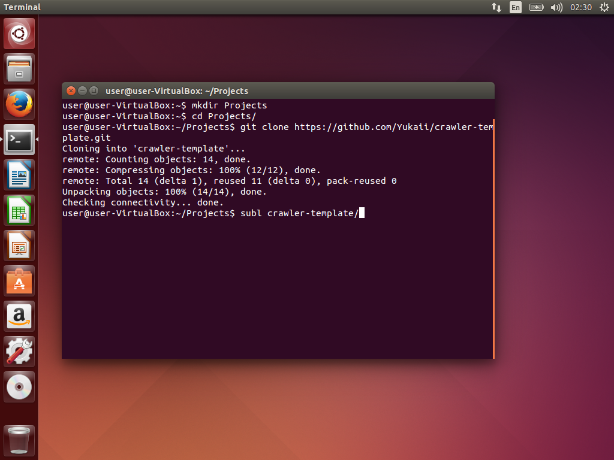
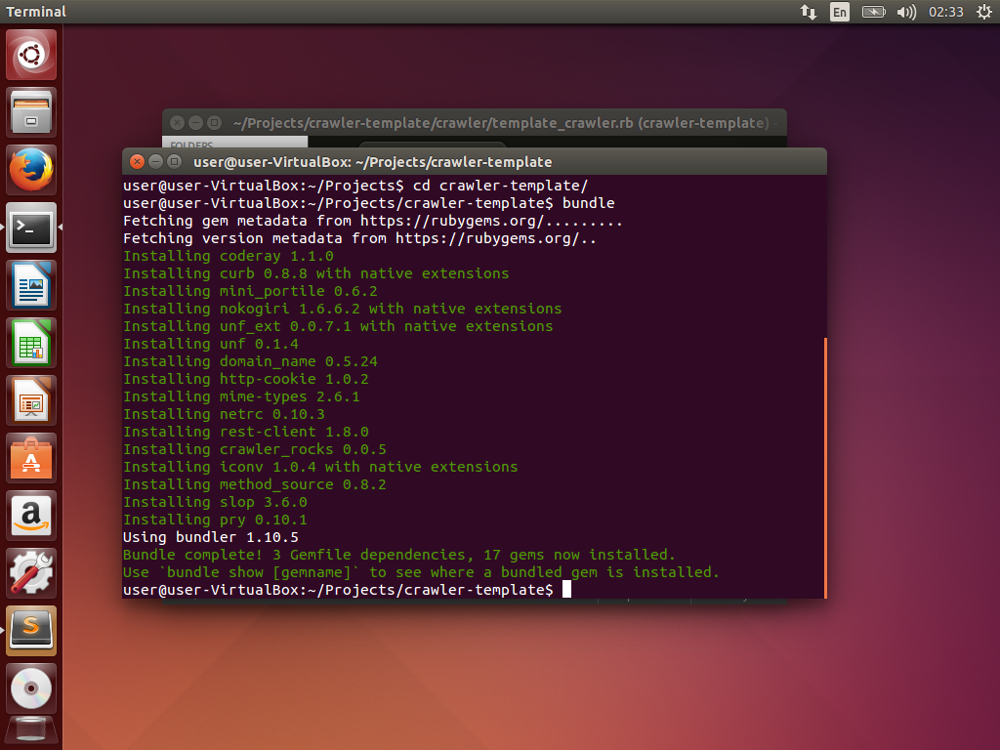

爬蟲範本
=======

目錄
===

* [關於](#關於)
* [安裝 Ruby 環境](#安裝-ruby-環境)
    * [Dependency](#dependency)
    * [RVM](#rvm)
    * [裝 Bundler](#裝-bundler)
    * [設定 git](#設定-git)

* [架構說明](#架構說明)
   * [Gemfile](#gemfile)
   * [template_crawler.rb](#template_crawlerrb)

* [其他](#其他)
    * [Sublime](#sublime)


# 關於

這是一份 Colorgy 的標準爬蟲結構說明。請在寫爬蟲的時候參考此範本，方便正規化。

一些案例或常用做法也會陸續更新上來。

# 安裝 Ruby 環境

* OSX 請看[MDev文件](https://github.com/MDev-tw/Guides/wiki/Mac-開發環境-裝機指南)，本篇之後也許會搬運過去。
* Ubuntu 請參照[此篇教學](https://gorails.com/setup/ubuntu/14.04)將 ruby 環境裝好。
```
    跑到裝完 bundler 就可以了，或是跟著我下面整理的。
```

## Dependency
```bash
sudo apt-get update
sudo apt-get install git-core curl zlib1g-dev build-essential libssl-dev libreadline-dev libyaml-dev libsqlite3-dev sqlite3 libxml2-dev libxslt1-dev libcurl4-openssl-dev python-software-properties libffi-dev
```

## RVM
```bash
sudo apt-get install libgdbm-dev libncurses5-dev automake libtool bison libffi-dev
gpg --keyserver hkp://keys.gnupg.net --recv-keys 409B6B1796C275462A1703113804BB82D39DC0E3
curl -sSL https://get.rvm.io | bash -s stable
```

重整一下，安裝 ruby 2.2.2
```bash
source ~/.rvm/scripts/rvm
rvm install 2.2.2
rvm use 2.2.2 --default
```

確定一下有沒有裝對
```bash
ruby -v
```

## 裝 Bundler
```bash
echo "gem: --no-ri --no-rdoc" > ~/.gemrc
gem install bundler
```

## 設定 git

```bash
git config --global color.ui true
git config --global user.name "YOUR NAME"
git config --global user.email "YOUR@EMAIL.com"
```

就做到這邊。

# 架構說明
可以先看[教學1](http://yukaihuang93.logdown.com/posts/243459/how-to-write-web-crawler-for-the-first-time-using-ruby)

```
.
├── Gemfile
├── Gemfile.lock
├── README.md
├── crawler
│   └── template_crawler.rb
└── img
```

```bash
git clone https://github.com/Yukaii/crawler-template.git
cd crawler-template
```
將此專案克隆回本機



## Gemfile
```ruby
source "https://rubygems.org"

gem 'crawler_rocks'
gem 'pry'
gem 'iconv'

```
ruby 的套件管理，其中 `crawler_rocks` 是小弟弄的 RestClient wrapper，`pry` 是常用的除錯工具，`iconv`是編碼轉換。

Gemfile 修改完跑 `bundle` 安裝 gem，產生 Gemfile.lock。


## template_crawler.rb
```ruby
require 'crawler_rocks'
require 'json'
require 'iconv'
require 'pry'

class TemplateCrawler

  def initialize
    @query_url = ""
    @ic = Iconv.new('utf-8//translit//IGNORE', 'big-5')
  end

  def courses
    @courses = []

    # start write your crawler here:
    binding.pry
    puts "hello"
  end
end

crawler = TemplateCrawler.new
File.write('courses.json', JSON.pretty_generate(crawler.courses()))

```

目前的慣例做法。

(待續)

# 其他

## Sublime
裝個好用的編輯器。

```bash
sudo add-apt-repository ppa:webupd8team/sublime-text-3
sudo apt-get update
sudo apt-get install sublime-text-installer
```
